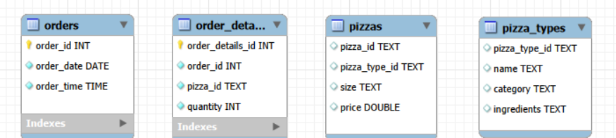
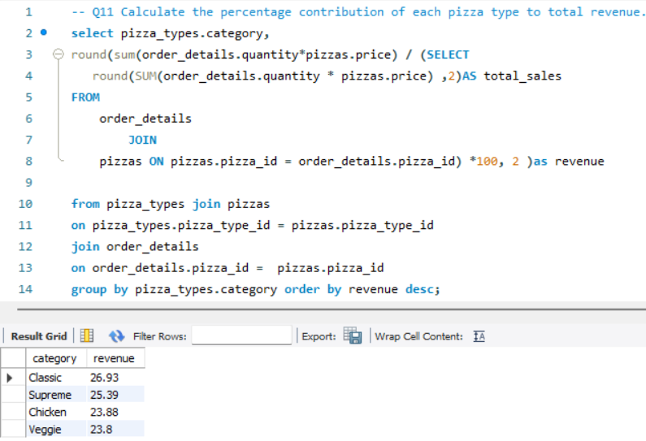
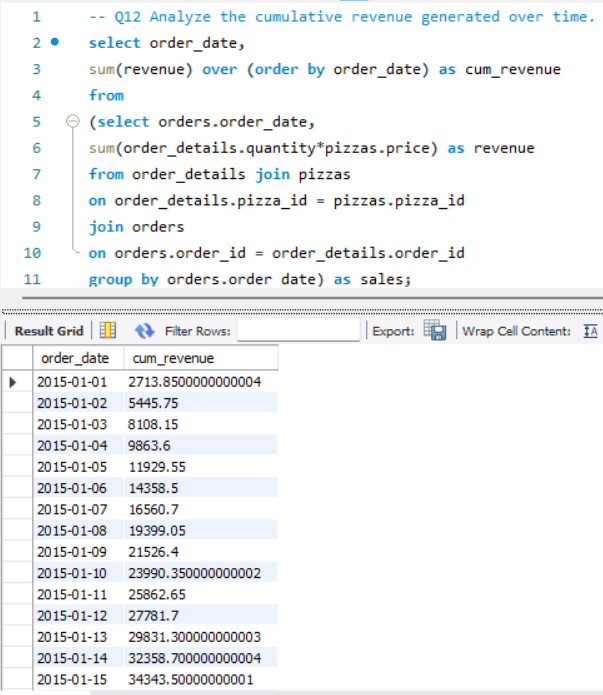
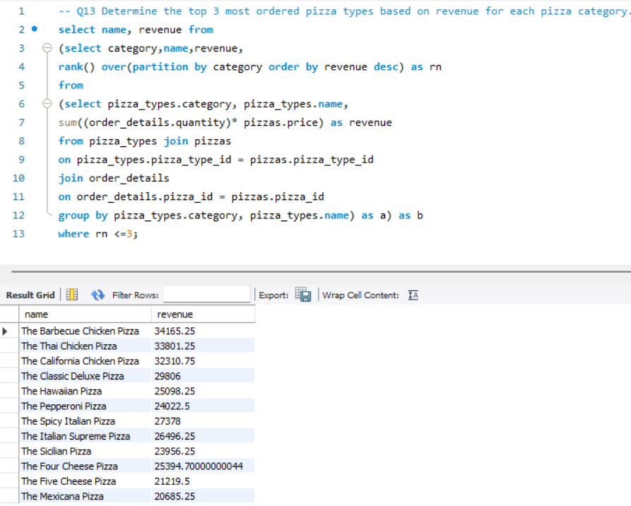

# 🍕 Pizza Sales SQL Analysis

## 📌 Project Overview

This project analyzes a Pizza Sales dataset using MySQL to answer real-world business questions. The analysis focuses on revenue, sales trends, customer ordering patterns, and best-performing pizzas using SQL queries.

## 🛠️ Tools Used

- MySQL
- MySQL Workbench
- SQL

## 📂 Dataset

The project uses four related tables:

- Orders
- Order Details
- Pizzas
- Pizza Types

## 🗂️ Database Schema

## 📊 Business Questions Solved

1. Retrieve the total number of orders.
2. Calculate total revenue generated.
3. Identify the highest-priced pizza.
4. Find the most common pizza size ordered.
5. List the top 5 most ordered pizza types.
6. Calculate total quantity sold by category.
7. Analyze order distribution by hour.
8. Find average pizzas ordered per day.
9. Determine the top 3 pizza types by revenue.
10. Calculate revenue contribution by pizza category.
11. Compute cumulative revenue over time.
12. Rank the highest revenue-generating pizzas within each category.

## 💡 SQL Concepts Used

- SELECT
- WHERE
- GROUP BY
- ORDER BY
- INNER JOIN
- Aggregate Functions
- Subqueries
- Common Business Queries
- Window Functions
- RANK()
- SUM() OVER()

## 📸 Project Screenshots

### Database Schema

### Top 3 Pizza Types by Revenue

### Revenue Contribution

### Cumulative Revenue

### Ranking Pizzas by Revenue

## 📈 Key Insights

- Generated total business revenue from pizza sales.
- Identified top-performing pizza types based on revenue.
- Analyzed category-wise revenue contribution.
- Studied hourly order trends.
- Calculated cumulative revenue using window functions.
- Ranked pizzas within each category based on revenue.

## 🚀 Author

**Priyanshi Gupta**

Aspiring Data Analyst passionate about SQL, Excel, Power BI, and Python.
